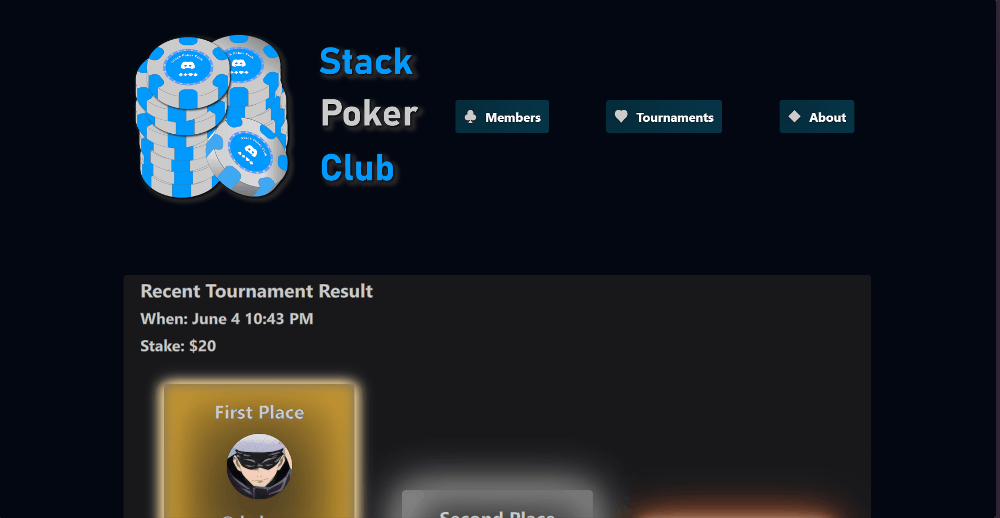
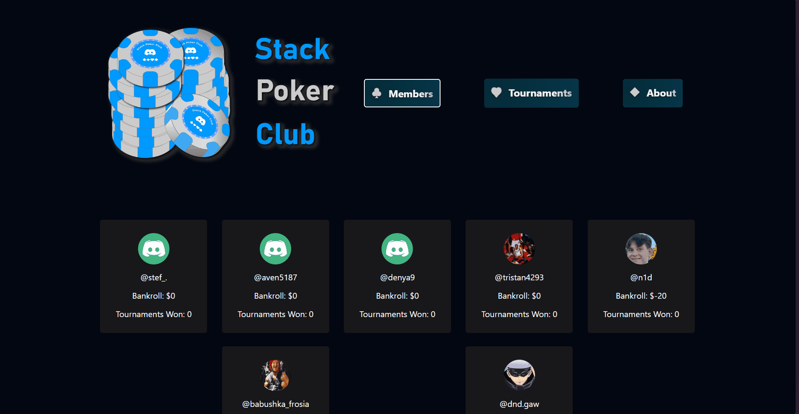

# Stack Poker Bot | Club

Welcome to the **Stack Poker Bot** project! This bot is designed for a Discord community that hosts poker nights using play chips. We have a passionate group who loves the strategic and deceptive aspects of poker, and we wanted a better way to manage our games and results. Hence, the Stack Poker Bot was born.

## Project Overview

The Stack Poker Bot leverages a Next.js frontend, a Python microservice Discord bot, and a Flask API to persist data for various user access points, including user data, tournaments, tournament results, and participants.

## Features

- **Frontend**: Built with Next.js to display data and manage user interactions.
- **Backend**: Python microservice and Flask API connected to a Postgres database to handle data persistence and bot functionality.
- **Discord Integration**: Seamless interaction within our Discord community for managing poker nights and tracking results.

## Stack Information

Here's an overview of the technology stack used in the Stack Poker Bot project:

### Frontend

- **Next.js**: A React framework for server-rendered applications.
- **JavaScript**: For interactive UI elements and API calls.
- **HTML/CSS**: For structuring and styling the web pages.

### Backend

- **Python**
- **Flask**
- **PostgreSQL**

### Discord Bot

- **Discord.py**: A Python wrapper for the Discord API, used to create the bot and manage its interactions within the Discord server.

## Development Journey

Starting with the bot, I connected it to my Flask-Postgres powered backend, quickly realizing the need for assets. Our community has a history of playing a game that evoked nostalgia, leading to the choice of a specific color palette for the frontend.

### Asset Inspiration

  

That beautiful off-white and those darker gray shadowed elements, combined with elegant blue shades, inspired the frontend design. When this "bag" dropped in the game, it contained some of the most coveted equipment, making it the perfect fit for our project.

## Assets at Play

### Bot Logo

  

### Figma Mockup

  

## Current Progress

I have successfully called the Flask API from the frontend locally. The next steps include constructing a display UI for recent tournament results, as outlined in the Figma mockup. Most MVP bot functions are completed, and the project is progressing smoothly.

## Demos and Visuals

### Home Page

### Members Overview

### Tournaments Section

## Future Plans

- **UI Enhancements**: Continue developing the UI for displaying tournament results.
- **Additional Features**: Explore adding new features to enhance the poker night experience.

Thank you for checking out the Stack Poker Bot project. Contributions and feedback are always welcome!