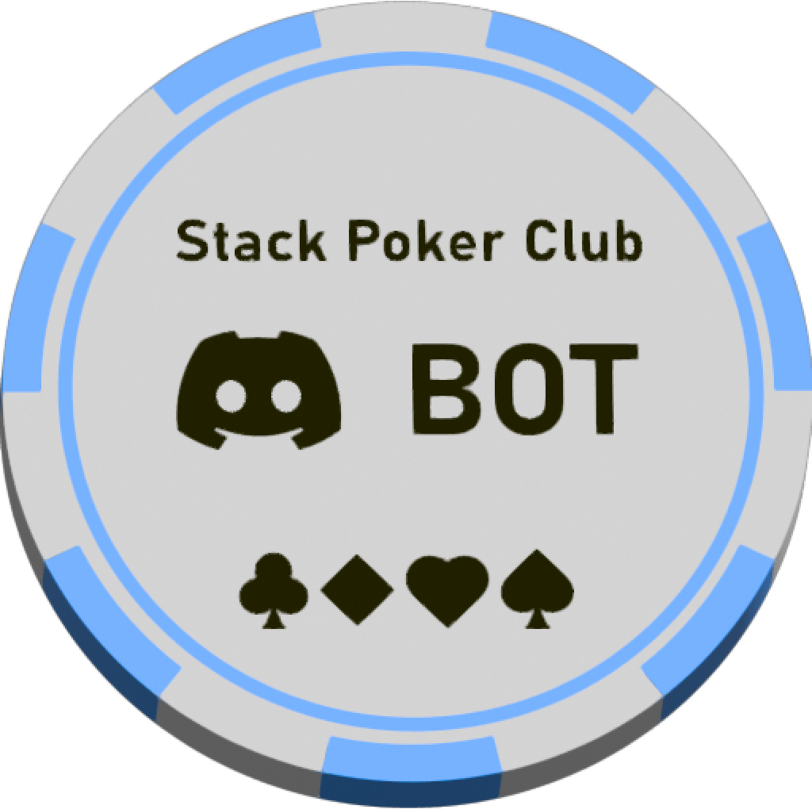

## Stack Poker Bot | Club

A discord community I am part of hosts poker nights for play chips,
and we all recently really got into the sport side of the game. It is 
a game of deception, chasing the odds, and playing your best hand (or face). We ran into the issue early on in keeping a fictional book, and I
figured there had to be a better way. In the end, I settled on a Next.js frontend, a python microservice discord bot, and a Flask API to persist data for all user access points**(user data, tournaments, tournament results, tournament participants)

**Front end for displaying data and the server for actions

I went away at programming a discord bot, and breathed life into it as I 
connected my Flask Postgres powered backend to it. I quickly ran into another issue. What in the hell am I gonna do for assets? This community I am part of is tight knit in a sense, I have known some of them for 20 years, some for less than a year. Lively mix. Anyways, we all at some time played a video game together that had a certain asset that created a certain type of dopamine. The asset can be seen below

That beautiful off-white and those darker gray shadowed elements. Lets not forget that elegant choice of blue(s). When this "bag" dropped from an enemy, it contained some of the most coveted equipment in the game. So I decided on this colour pallete to create the front end.

### Assets at Play

#### Here is the bot logo:

#### Figma Mockup

#### Demo of (Responsive) Frontend...so far

## Where I am so Far

I am continuing development, I have successfully called to the Flask API in the front end locally. Next steps would be to construct a display UI for recent tournament results (like in the figma mockup), since most of the MVP bot functions are completed.
